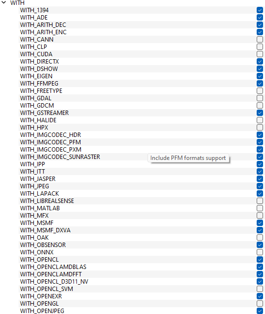
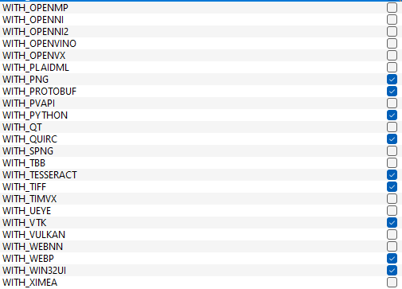
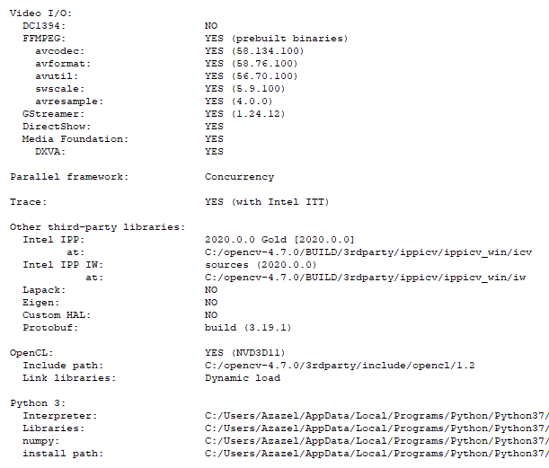

# 🛠️ BachelorGUI2025 – SubSea GUI System

A cross-platform graphical interface and backend system for processing and streaming media in real time using Python, OpenCV, .NET, and Node.js.

---

## 📖 Table of Contents

- [Prerequisites](#-prerequisites)
- [Connecting to Jetson](#-connecting-to-the-jetson-and-starting-the-program)
- [Setup Guides](#-setup-guides)
  - [🐧 Linux (Ubuntu/Debian) Setup](#linux-ubuntudebian-setup)
  - [🪟 Windows Setup](#windows-setup)
- [SDL2 Troubleshooting](#-sdl2-troubleshooting)

---

## 📦 Prerequisites

- Python 3.7
- Node.js (v18 or later)
- .NET SDK (v8.0 or later)
- CMake with GUI
- GStreamer and FFmpeg

---

## 🔌 Connecting to the Jetson and Starting the Program

To connect to the Jetson device and start the control software:

1. Open a terminal and SSH into the Jetson:
   ```
   ssh jetson@10.0.0.2
   ```

2. When prompted, enter the password:
   ```
   jetson
   ```

3. Once connected, run the startup script with superuser privileges:
   ```
   sudo ./startup.sh
   ```

4. When prompted again, enter the password:
   ```
   jetson
   ```
---

## 🧰 Setup Guides

<details>
<summary><strong>🔧 Linux (Ubuntu/Debian) Setup Guide</strong></summary>

### Linux (Ubuntu/Debian) Setup

1. **Download the GUI project from the repository.**

2. **Open a terminal and run the following commands (Skip any step you've already completed):**

   ```bash
   sudo apt update
   sudo apt install -y software-properties-common
   sudo add-apt-repository ppa:deadsnakes/ppa
   sudo apt update
   sudo apt-get install python3.7 python3.7-venv python3.7-distutils python3.7-dev python3.7-numpy
   sudo apt-get install libsrtp2-dev
   sudo apt-get install gcc g++
   ```

3. **Install GTK, camera, and media support:**

   ```bash
   sudo apt-get install libavcodec-dev libavformat-dev libswscale-dev
   sudo apt-get install libgstreamer-plugins-base1.0-dev libgstreamer1.0-dev
   sudo apt-get install libgtk-3-dev
   sudo apt-get install libpng-dev
   sudo apt-get install libjpeg-dev
   sudo apt-get install libopenexr-dev
   sudo apt-get install libtiff-dev
   sudo apt-get install libwebp-dev
   ```

4. **Verify Python version:**

   ```bash
   python3.7 --version
   ```

5. **Navigate to the project backend:**

   ```bash
   cd BachelorGUI2025/Backend
   ```

6. **Create and activate a virtual environment:**

   ```bash
   python3.7 -m venv myenv
   source myenv/bin/activate
   ```

7. **Navigate to the Python scripts:**

   ```bash
   cd PythonScripts
   ```

8. **Install Python dependencies:**

   ```bash
   pip install -r requirements.txt
   ```

9. **Install GStreamer:**

   ```bash
   sudo apt install gstreamer1.0-tools gstreamer1.0-plugins-base \
   gstreamer1.0-plugins-good gstreamer1.0-plugins-bad \
   gstreamer1.0-plugins-ugly gstreamer1.0-libav \
   libgstreamer1.0-dev
   ```

10. **Install FFmpeg:**

    ```bash
    sudo apt install ffmpeg
    ```

11. **Manually compile OpenCV:**

    - **Install CMake and CMake GUI (version 4.0.0):**

      ```bash
      sudo apt-get install cmake
      sudo apt-get install cmake-qt-gui
      ```

    - **To open CMake later:**

      ```bash
      cmake-gui
      ```

    - **Download and set up OpenCV 4.7.0 and Contrib:**

      ```bash
      mkdir ~/opencv_build && cd ~/opencv_build
      git clone -b 4.7.0 https://github.com/opencv/opencv.git
      git clone -b 4.7.0 https://github.com/opencv/opencv_contrib.git
      cd opencv
      mkdir build && cd build
      ```

    - **Open CMake GUI **from a terminal where the virtual environment is active**.**

    - **In CMake GUI:**
        - Set the source code path to the `opencv` folder.
        - Set the build path to the `opencv/build` folder.
        - Add `OPENCV_EXTRA_MODULES_PATH` pointing to `opencv_contrib/modules`.

    - Click **Configure** and verify the GStreamer and Python fields are set correctly (as shown in the image under).

    

    - **Choose the generator (e.g., `Unix Makefiles`).**

    - **Build OpenCV:**
      - Open a terminal, navigate to the build directory, and run 

      ```bash
      make -j4
      ```

    - **Install OpenCV:**

      ```bash
      sudo make install
      ```

    - **Copy the `cv2` folder to your virtual environment:**

      ```bash
      cp -r cv2 ~/BachelorGUI2025/Backend/myenv/lib/site-packages
      ```

    - **Verify installation:**

      ```bash
      python -c "import cv2; print(cv2.__version__)"
      ```

12. **Install Node.js, npm, and .NET 8:**

    ```bash
    sudo apt install nodejs npm
    sudo apt install dotnet-sdk-8.0
    ```

13. **Build and run the backend:**

    ```bash
    cd Backend
    dotnet restore
    dotnet build
    dotnet run
    ```

14. **Start the frontend:**

    ```bash
    cd ../GUI-Frontend
    npm i
    npm run package
    npm start
    ```

</details>

<details>
<summary><strong>🔧 Windows Setup Guide</strong></summary>

### Windows Setup

1. **Download the GUI project from the repository.**

2. **Download Python version 3.7.0**
   - Go to the [Python 3.7.0 Release Page](https://www.python.org/downloads/release/python-370/)
   - Download the installer for your Windows version (e.g. *Windows x86-64 executable installer*).
   - Install Python and **ensure** the "Add Python to PATH" option is **checked** during installation.

3. **Install NumPy in Python 3.7** (needed to compile OpenCV).

4. **Open the folder `BachelorGUI2025\Backend` in a terminal.**

5. **Create a virtual environment:**
   ```bash
   python3.7 -m venv myenv
   ```

6. **Activate the virtual environment:**
   ```bash
   .\myenv\Scripts\activate
   ```
   - To deactivate:
     ```bash
     deactivate
     ```

7. **Navigate to the PythonScripts folder:**
   ```bash
   cd PythonScripts
   ```

8. **Install dependencies:**
   ```bash
   pip install -r requirements.txt
   ```

9. **Manually compile OpenCV with GStreamer support:**

   - **Download and install CMake 4.0.0** from the [CMake Download Page](https://cmake.org/download/)
   - Select the appropriate version for your system, e.g., Windows x64 Installer: `cmake-4.0.0-windows-x86_64.msi`
   - Run the installer and ensure that the option to add CMake to the system PATH is checked during installation.

   - **Download OpenCV 4.7.0 and OpenCV Contrib**, and create a `build` folder inside the OpenCV directory.

   - **Install GStreamer 1.24.12**:
     - [GStreamer 1.24.12 (MSVC) Download Page](https://gstreamer.freedesktop.org/data/pkg/windows/1.24.12/msvc/)
     - Download and install both:
       - `gstreamer-1.0-msvc-x86_64-1.24.12.msi`
       - `gstreamer-1.0-devel-msvc-x86_64-1.24.12.msi`
     - Add the GStreamer `bin` folder to your system PATH.

   - **Install FFmpeg** from [FFmpeg Builds](https://www.gyan.dev/ffmpeg/builds/)

   - **Install Visual Studio 2022 (version 17)** from [Visual Studio](https://visualstudio.microsoft.com/)

   - **Compile OpenCV using CMake GUI:**
     1. Open `CMake-gui` and Set "Browse Source..." to the OpenCV folder.
     2. Set "Browse Build..." to the `build` folder.
     4. Click **Configure**.
     

     

     4. Choose *Visual Studio 17*, then **Finish**.

     

     5. Wait for analysis to complete. Red entries will appear.

     6. Expand the `WITH` section, enable necessary features (see image under for what was used, (if `WITH_PYTHON` isn’t present, you can add it manually
using the `Add Entry` button).

     
     

     7. Expand the `BUILD` section and adjust as needed.

     
     

     8. Expand `ENABLE`, disable `ENABLE_SOLUTION_FOLDERS` and adjust as needed.

     

     9. Ensure GStreamer fields are present and set correctly, If they are not visible, manually add them. If they are present but have no path, set the correct path to
where GStreamer is installed..

     

     10. Check the `PYTHON3` field paths.

     

     11. Add `OPENCV_EXTRA_MODULES_PATH` pointing to the OpenCV Contrib modules folder.

     12. Click **Configure** again. Scroll the log window to check for `YES` next to GStreamer. If `NO` appears, troubleshoot and adjust the settings. Also, verify that the Python 3 fields have the correct paths. If any fields are missing or have blank paths, OpenCV will not be configured for Python, which is necessary.


     

     13. If all is good, click **Generate**, then **Open Project**.

     14. Set build mode to **Release**.

     15. In Solution Explorer, right-click **Solution** or **ALL_BUILD** → **Build**.

     16. Once done, right-click **INSTALL** and build it. This installs OpenCV-Python.

     

     17. After the installation, OpenCV will be in the folder specified in the installation path. Copy the `cv2` folder into your virtual environment:
     ```
     BachelorGUI2025\Backend\myenv\Lib\site-packages
     ```

     18. **Verify installation:**
     ```bash
     python -c "import cv2; print(cv2.__version__)"
     ```

10. **Install Node.js (v18+), npm, and .NET (v8+):**

    - [Node.js 18](https://nodejs.org/en/)
    - [.NET SDK 8.0](https://dotnet.microsoft.com/en-us/download/dotnet/8.0)

11. **Navigate to the Backend folder and run:**
    ```bash
    dotnet restore
    dotnet build
    ```

12. **Start the backend:**
    ```bash
    dotnet run
    ```

13. **Start the frontend:**

    - Navigate to the `GUI-Frontend` folder.

    - Install dependencies:
      ```bash
      npm i
      npm run package
      ```

    - Start frontend:
      ```bash
      npm start
      ```

</details>

---

## 🔧 SDL2 Troubleshooting

The project uses [SDL2-CS](https://github.com/flibitijibibo/SDL2-CS) to handle controller input across platforms. In most cases, SDL2 should work out-of-the-box after cloning the project, as the necessary native libraries are bundled via SDL2-CS.

However, if controller input does not function correctly on your system, you can try running the appropriate script below to fix your SDL2 installation:

| Operating System | Script |
|------------------|--------|
| Windows          | `install-sdl2-windows.ps1` *(PowerShell)* |
| Linux            | `install-sdl2-linux.sh` *(Bash)* |
| macOS            | `install-sdl2-macos.sh` *(Bash)* |

### 📌 Usage

Run the script that matches your OS from the project root:

- **Windows (PowerShell):**
  ```powershell
  ./install-sdl2-windows.ps1
  ```

- **Linux/macOS (Bash):**
  ```bash
  chmod +x install-sdl2-linux.sh  # or install-sdl2-macos.sh
  ./install-sdl2-linux.sh         # or ./install-sdl2-macos.sh
  ```

If the issue persists after running the script, you may need to manually configure or install SDL2 for your platform.
